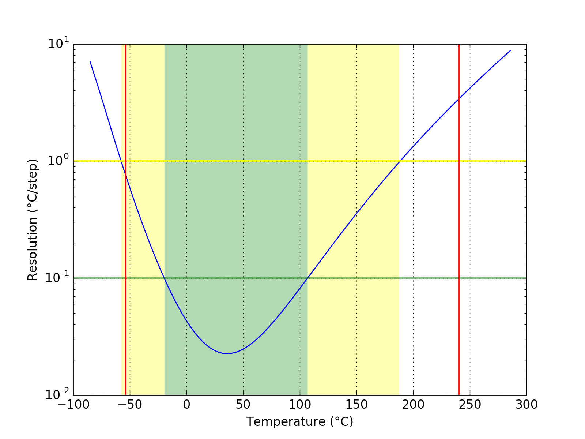
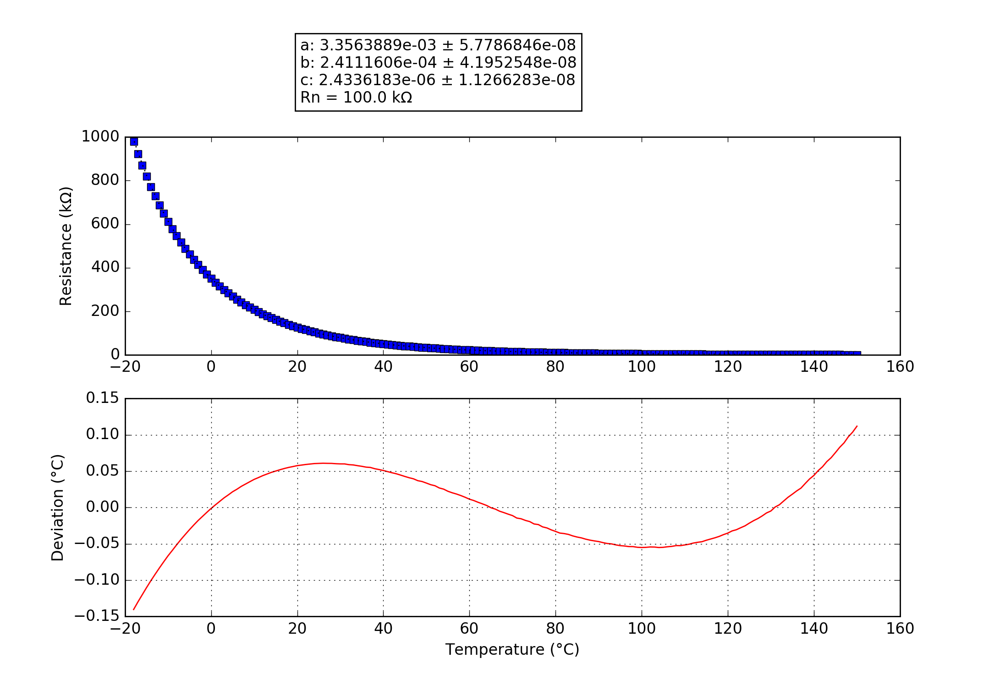

## 100K6A1B
### Probe performance data

Values based on 47k measurement resistor.

Property | Symbol | Value
-------- | -------- | --------
Resistance at 0°C | R0 | 351.04k
Resistance at 25°C | R25 | 99.72k
Resistance at 85°C | R85 | 9.13k
Beta 25°C to 85°C | B25/85| 4254K
Minimum measurable temperature | | -54.0°C
Minimum high-res temperature | | -19.6°C
Highest resolution || 2.26e-02°C/step at 36.0°C
Maximum high-res temperature | | 106.8°C
Maximum measurable temperature | | 240.5°C

### Probe curve data

Property | Symbol | Value
-------- | -------- | --------
Resistance near 25°C | R251 | 100.00k
Steinhart-Hart coefficient | a | 3.3563889e-03 ± 5.7786846e-08
Steinhart-Hart coefficient | b | 2.4111606e-04 ± 4.1952548e-08
Steinhart-Hart coefficient | c | 2.4336183e-06 ± 1.1266283e-08

1: The deviation between this R25 and the R25 shown above is not relevant, this R25 is taken from the original data point which is closest to 25°C. The value taken as a factor into the calculation of the final value and serves only a scaling purpose to the Steinhart-Hart coefficients.
