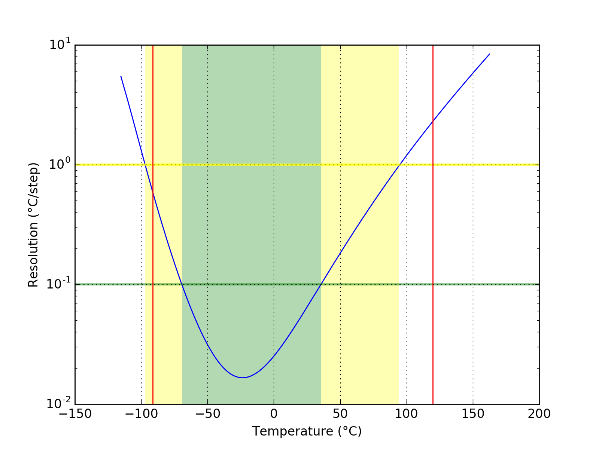
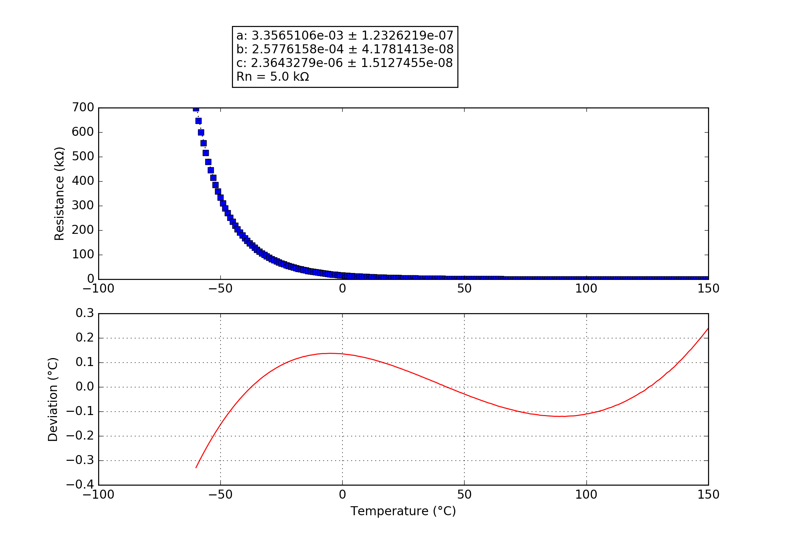

## 5K3A1B
### Probe performance data

Values based on 47k measurement resistor.

Property | Symbol | Value
-------- | -------- | --------
Resistance at 0°C | R25 | 16.21k
Resistance at 25°C | R25 | 4.98k
Resistance at 85°C | R25 | 0.54k
Beta 25°C to 85°C | B25/85| 3964K
Minimum measurable temperature | | 113.7°C
Minimum high-res temperature | | -69.3°C
Highest resolution || 1.66e-02°C/step at -23.6°C
Maximum high-res temperature | | 35.5°C
Maximum measurable temperature | | -89.2°C

### Probe curve data

Property | Symbol | Value
-------- | -------- | --------
Resistance near 25°C | R251 | 5.00k
Steinhart-Hart coefficient | a | 3.3565106e-03 ± 1.2326219e-07
Steinhart-Hart coefficient | b | 2.5776158e-04 ± 4.1781413e-08
Steinhart-Hart coefficient | c | 2.3643279e-06 ± 1.5127455e-08

1: The deviation between this R25 and the R25 shown above is not relevant, this R25 is taken from the original data point which is closest to 25°C. The value taken as a factor into the calculation of the final value and serves only a scaling purpose to the Steinhart-Hart coefficients.
