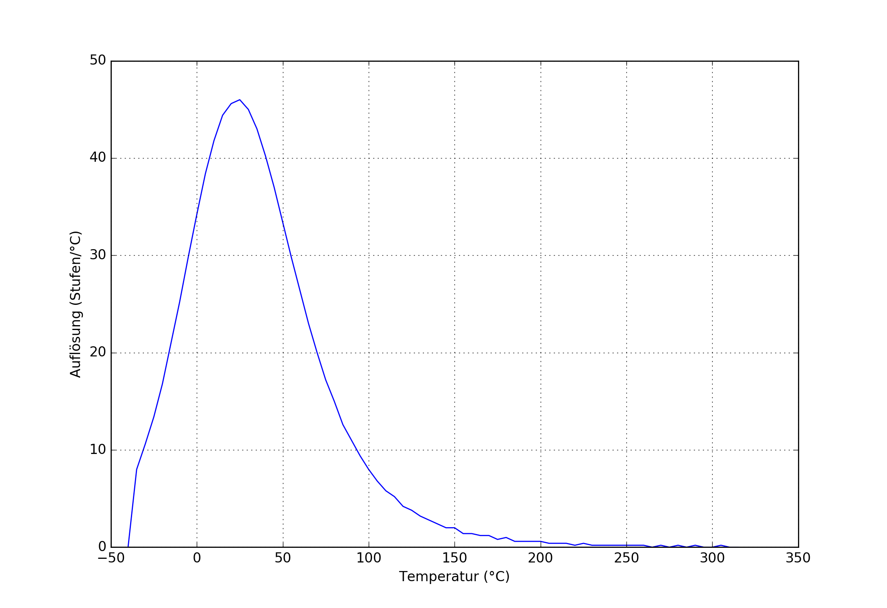
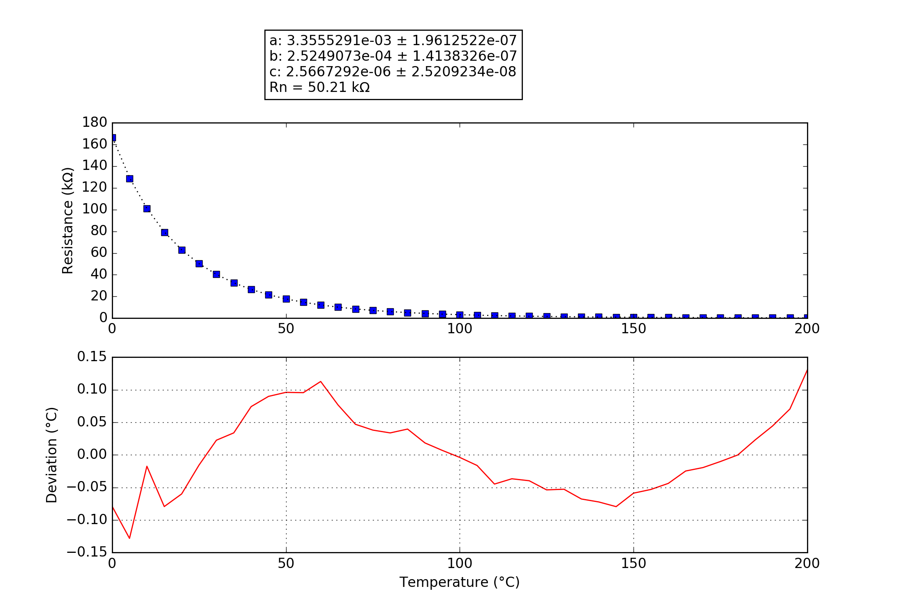

## ACURITE
### Probe performance data

Values based on 47k measurement resistor.

Property | Symbol | Value
-------- | -------- | --------
Resistance at 0°C | R25 | 167.21k
Resistance at 25°C | R25 | 50.24k
Resistance at 85°C | R25 | 5.14k
Beta 25°C to 85°C | B25/85| 4058K
Minimum measurable temperature | | 209.9°C
Minimum high-res temperature | | 90.2°C
Highest resolution || 2.17e-02°C/step at 20.7°C
Maximum high-res temperature | | -33.3°C
Maximum measurable temperature | | -62.6°C

### Probe curve data

Property | Symbol | Value
-------- | -------- | --------
Resistance near 25°C | R251 | 50.21k
Steinhart-Hart coefficient | a | 3.3555291e-03 ± 1.9612522e-07
Steinhart-Hart coefficient | b | 2.5249073e-04 ± 1.4138326e-07
Steinhart-Hart coefficient | c | 2.5667292e-06 ± 2.5209234e-08

1: The deviation between this R25 and the R25 shown above is not relevant, this R25 is taken from the original data point which is closest to 25°C. The value taken as a factor into the calculation of the final value and serves only a scaling purpose to the Steinhart-Hart coefficients.
