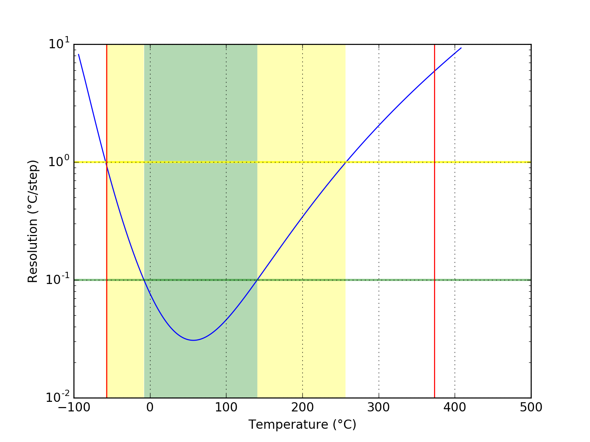
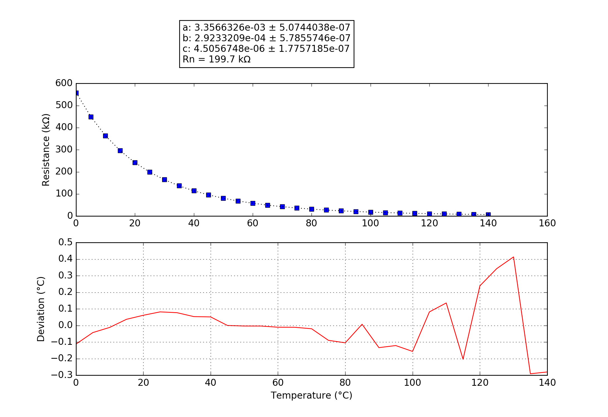

## Maverick ET-72,73
### Probe performance data

Values based on 47k measurement resistor.

Property | Symbol | Value
-------- | -------- | --------
Resistance at 0°C | R25 | 560.28k
Resistance at 25°C | R25 | 199.07k
Resistance at 85°C | R25 | 27.35k
Beta 25°C to 85°C | B25/85| 3532K
Minimum measurable temperature | | 357.7°C
Minimum high-res temperature | | -7.8°C
Highest resolution || 3.07e-02°C/step at 57.0°C
Maximum high-res temperature | | 140.7°C
Maximum measurable temperature | | -53.5°C

### Probe curve data

Property | Symbol | Value
-------- | -------- | --------
Resistance near 25°C | R251 | 199.70k
Steinhart-Hart coefficient | a | 3.3566326e-03 ± 5.0744038e-07
Steinhart-Hart coefficient | b | 2.9233209e-04 ± 5.7855746e-07
Steinhart-Hart coefficient | c | 4.5056748e-06 ± 1.7757185e-07

1: The deviation between this R25 and the R25 shown above is not relevant, this R25 is taken from the original data point which is closest to 25°C. The value taken as a factor into the calculation of the final value and serves only a scaling purpose to the Steinhart-Hart coefficients.
