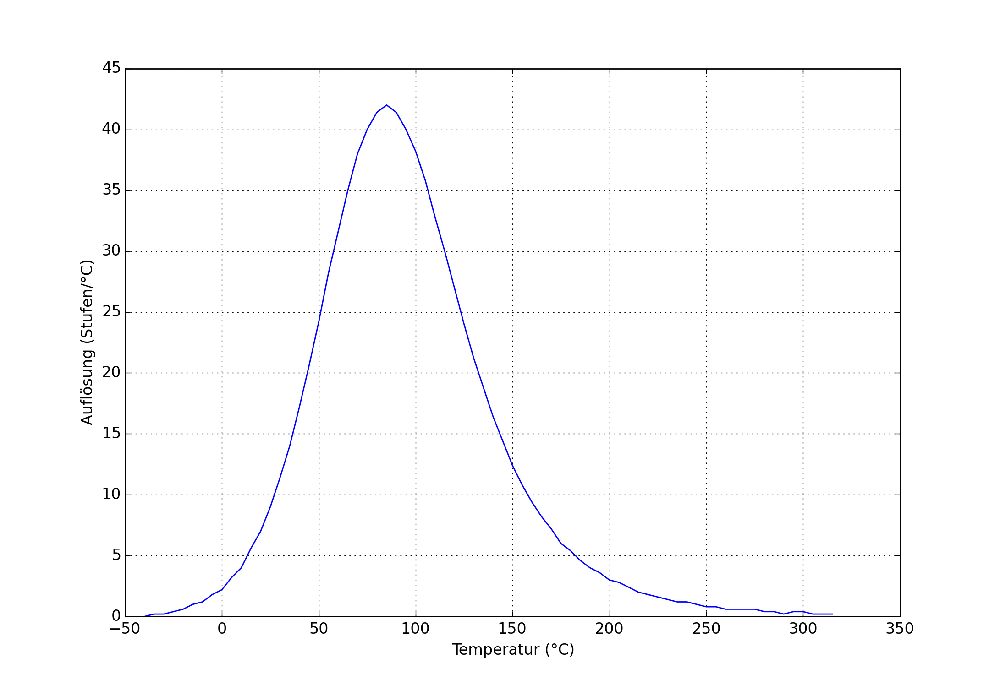
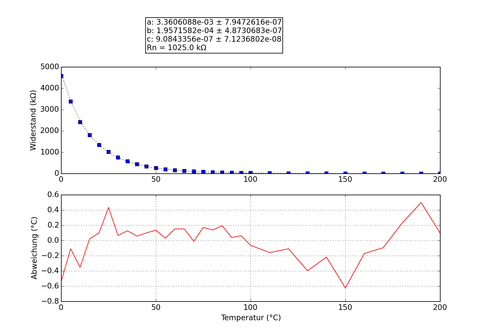

## ET-735
### Probe performance data

Values based on 47k measurement resistor.

Property | Symbol | Value
-------- | -------- | --------
Resistance at 0°C | R25 | 4688.76k
Resistance at 25°C | R25 | 994.17k
Resistance at 85°C | R25 | 54.63k
Beta 25°C to 85°C | B25/85| 5164K
Minimum measurable temperature | | 289.6°C
Minimum high-res temperature | | 155.5°C
Highest resolution || 2.40e-02°C/step at 82.5°C
Maximum high-res temperature | | 24.7°C
Maximum measurable temperature | | -10.3°C

### Probe curve data

Property | Symbol | Value
-------- | -------- | --------
Resistance near 25°C | R251 | 998.90k
Steinhart-Hart coefficient | a | 3.3566373e-03 ± 4.8422539e-07
Steinhart-Hart coefficient | b | 1.9664428e-04 ± 2.7692726e-07
Steinhart-Hart coefficient | c | 9.6248678e-07 ± 3.9284795e-08

1: The deviation between this R25 and the R25 shown above is not relevant, this R25 is taken from the original data point which is closest to 25°C. The value taken as a factor into the calculation of the final value and serves only a scaling purpose to the Steinhart-Hart coefficients.
