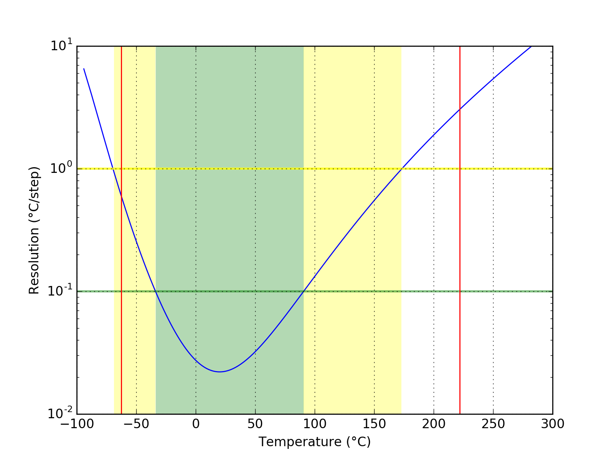

## FANTAST
### Probe performance data

Values based on 47k measurement resistor.

Property | Symbol | Value
-------- | -------- | --------
Resistance at 0°C | R25 | 164.01k
Resistance at 25°C | R25 | 50.05k
Resistance at 85°C | R25 | 5.44k
Beta 25°C to 85°C | B25/85| 3951K
Minimum measurable temperature | | 221.9°C
Minimum high-res temperature | | 90.6°C
Highest resolution || 2.20e-02°C/step at 20.1°C
Maximum high-res temperature | | -33.8°C
Maximum measurable temperature | | -62.5°C

### Probe curve data

Property | Symbol | Value
-------- | -------- | --------
Resistance near 25°C | R251 | 50.08k
Steinhart-Hart coefficient | a | 3.3558340e-03 ± 1.9359242e-07
Steinhart-Hart coefficient | b | 2.5698192e-04 ± 1.4451167e-07
Steinhart-Hart coefficient | c | 1.6391056e-06 ± 2.6808982e-08

1: The deviation between this R25 and the R25 shown above is not relevant, this R25 is taken from the original data point which is closest to 25°C. The value taken as a factor into the calculation of the final value and serves only a scaling purpose to the Steinhart-Hart coefficients.
