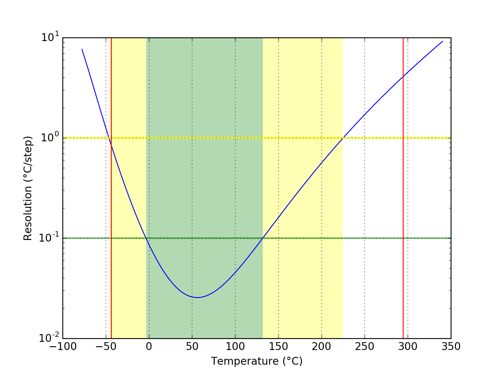
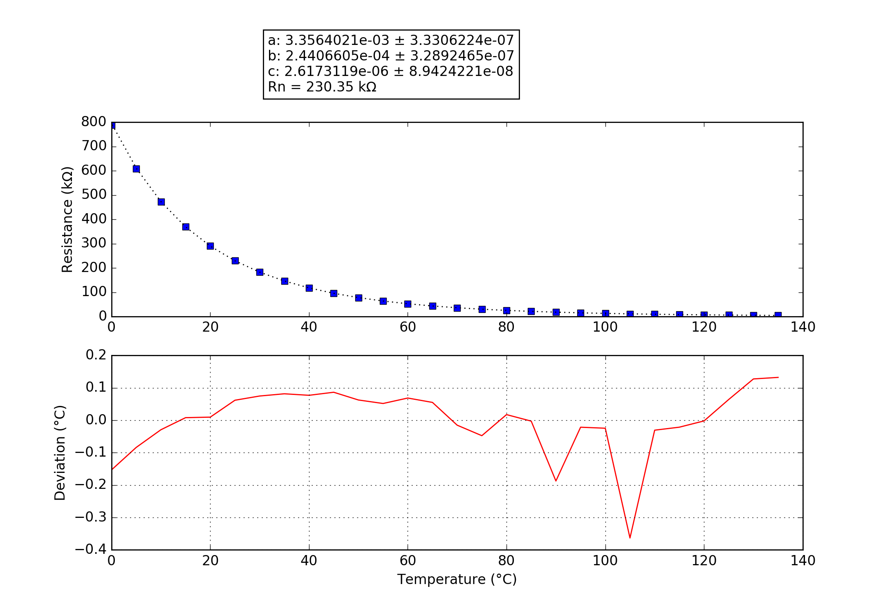

## Fantast_Neu
### Probe performance data

Values based on 47k measurement resistor.

Property | Symbol | Value
-------- | -------- | --------
Resistance at 0°C | R0 | 795.80k
Resistance at 25°C | R25 | 229.69k
Resistance at 85°C | R85 | 21.59k
Beta 25°C to 85°C | B25/85| 4208K
Minimum measurable temperature | | -43.7°C
Minimum high-res temperature | | -3.4°C
Highest resolution || 2.55e-02°C/step at 56.1°C
Maximum high-res temperature | | 131.9°C
Maximum measurable temperature | | 294.6°C

### Probe curve data

Property | Symbol | Value
-------- | -------- | --------
Resistance near 25°C | R251 | 230.35k
Steinhart-Hart coefficient | a | 3.3564021e-03 ± 3.3306224e-07
Steinhart-Hart coefficient | b | 2.4406605e-04 ± 3.2892465e-07
Steinhart-Hart coefficient | c | 2.6173119e-06 ± 8.9424221e-08

1: The deviation between this R25 and the R25 shown above is not relevant, this R25 is taken from the original data point which is closest to 25°C. The value taken as a factor into the calculation of the final value and serves only a scaling purpose to the Steinhart-Hart coefficients.
