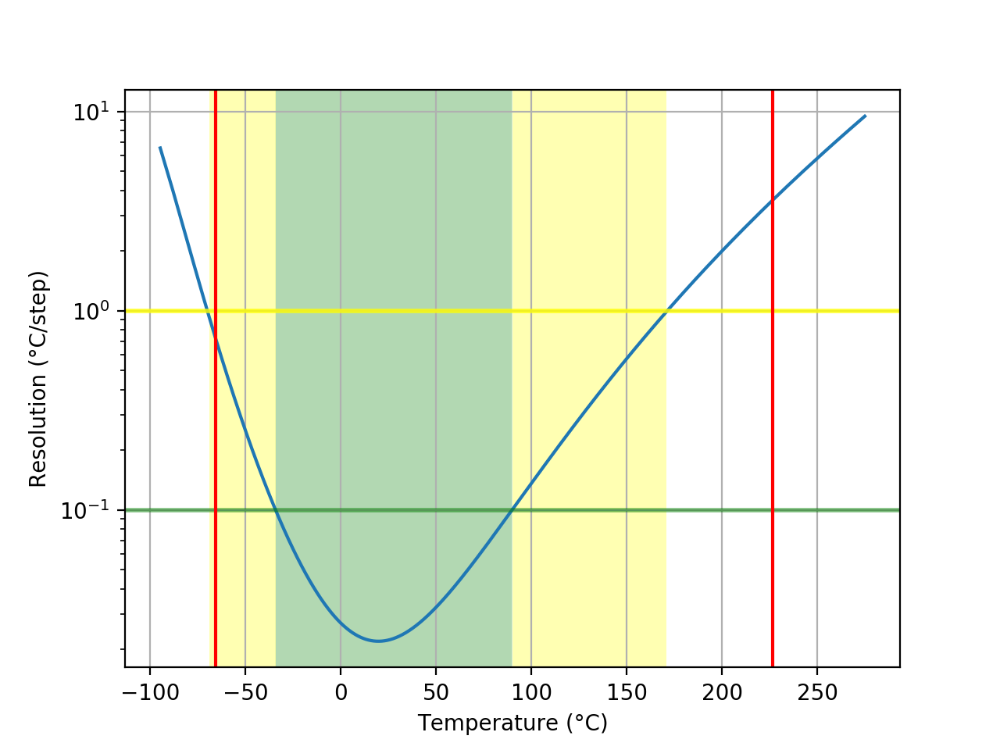
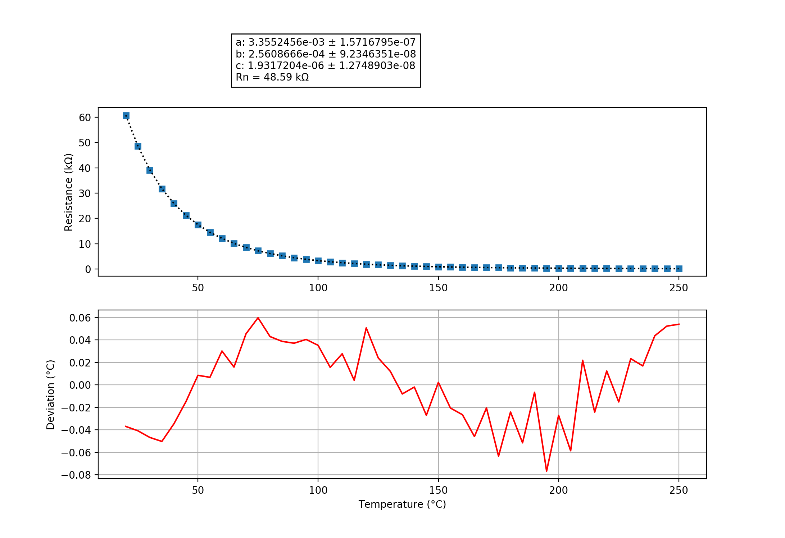

## Inkbird
### Probe performance data

Values based on 47k measurement resistor.

Property | Symbol | Value
-------- | -------- | --------
Resistance at 0°C | R0 | 159.89k
Resistance at 25°C | R25 | 48.68k
Resistance at 85°C | R85 | 5.21k
Beta 25°C to 85°C | B25/85| 3975K
Minimum measurable temperature | | -65.7°C
Minimum high-res temperature | | -34.2°C
Highest resolution || 2.19e-02°C/step at 19.7°C
Maximum high-res temperature | | 89.8°C
Maximum measurable temperature | | 226.5°C

### Probe curve data

Property | Symbol | Value
-------- | -------- | --------
Resistance near 25°C | R251 | 48.59k
Steinhart-Hart coefficient | a | 3.3552456e-03 ± 1.5716795e-07
Steinhart-Hart coefficient | b | 2.5608666e-04 ± 9.2346351e-08
Steinhart-Hart coefficient | c | 1.9317204e-06 ± 1.2748903e-08

1: The deviation between this R25 and the R25 shown above is not relevant, this R25 is taken from the original data point which is closest to 25°C. The value taken as a factor into the calculation of the final value and serves only a scaling purpose to the Steinhart-Hart coefficients.
