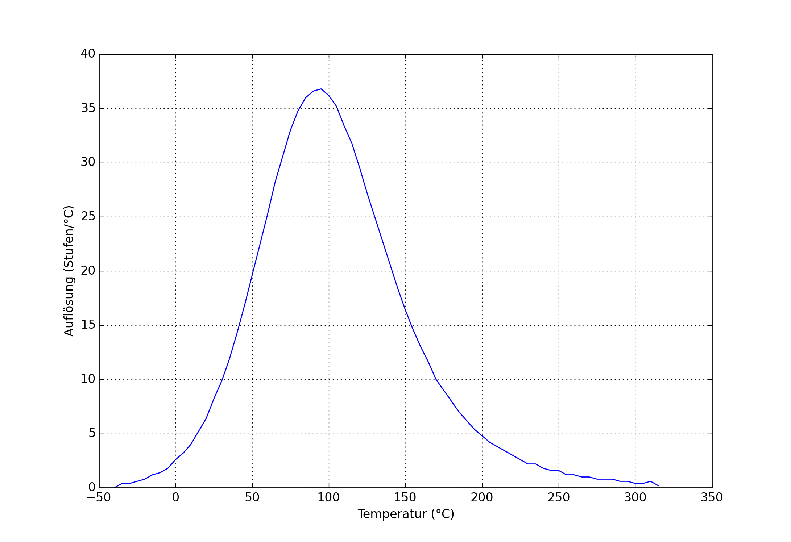
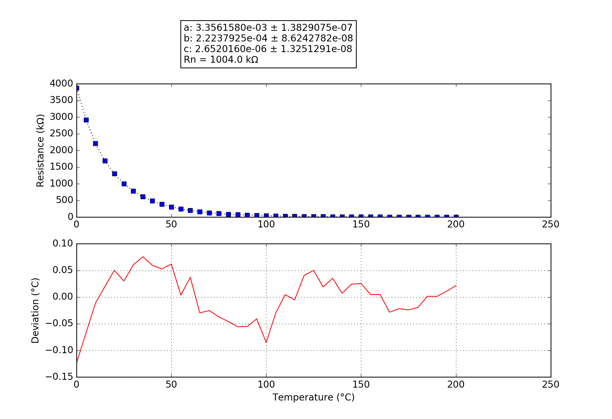

## MAVERICK
### Probe performance data

Values based on 47k measurement resistor.

Property | Symbol | Value
-------- | -------- | --------
Resistance at 0°C | R25 | 3903.35k
Resistance at 25°C | R25 | 1001.96k
Resistance at 85°C | R25 | 73.65k
Beta 25°C to 85°C | B25/85| 4646K
Minimum measurable temperature | | 322.6°C
Minimum high-res temperature | | 168.1°C
Highest resolution || 2.72e-02°C/step at 90.3°C
Maximum high-res temperature | | 28.0°C
Maximum measurable temperature | | -14.7°C

### Probe curve data

Property | Symbol | Value
-------- | -------- | --------
Resistance near 25°C | R251 | 1004.00k
Steinhart-Hart coefficient | a | 3.3561580e-03 ± 1.3829075e-07
Steinhart-Hart coefficient | b | 2.2237925e-04 ± 8.6242782e-08
Steinhart-Hart coefficient | c | 2.6520160e-06 ± 1.3251291e-08

1: The deviation between this R25 and the R25 shown above is not relevant, this R25 is taken from the original data point which is closest to 25°C. The value taken as a factor into the calculation of the final value and serves only a scaling purpose to the Steinhart-Hart coefficients.
