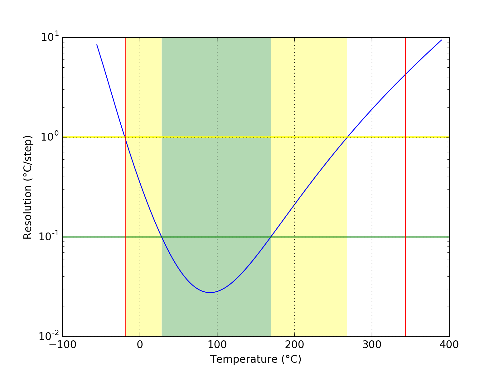
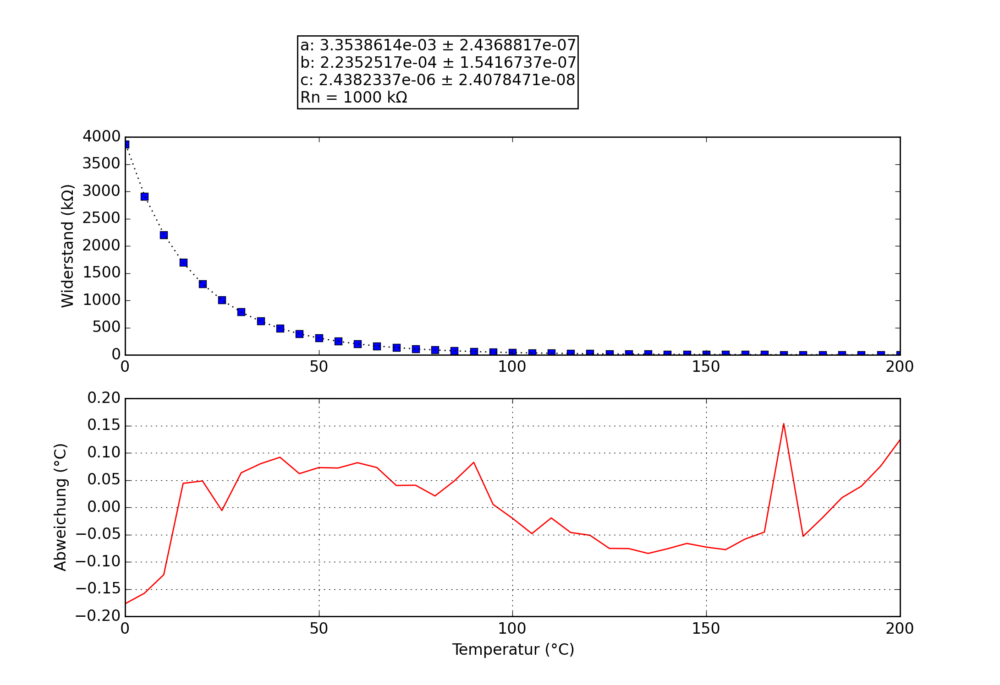

## ODC
### Probe performance data

Values based on 47k measurement resistor.

Property | Symbol | Value
-------- | -------- | --------
Resistance at 0°C | R25 | 3907.01k
Resistance at 25°C | R25 | 1008.28k
Resistance at 85°C | R25 | 75.74k
Beta 25°C to 85°C | B25/85| 4607K
Minimum measurable temperature | | 332.0°C
Minimum high-res temperature | | 28.3°C
Highest resolution || 2.76e-02°C/step at 90.9°C
Maximum high-res temperature | | 169.5°C
Maximum measurable temperature | | -14.7°C

### Probe curve data

Property | Symbol | Value
-------- | -------- | --------
Resistance near 25°C | R251 | 1008.00k
Steinhart-Hart coefficient | a | 3.3556427e-03 ± 2.4459794e-07
Steinhart-Hart coefficient | b | 2.2356403e-04 ± 1.5453261e-07
Steinhart-Hart coefficient | c | 2.4382337e-06 ± 2.4078478e-08

1: The deviation between this R25 and the R25 shown above is not relevant, this R25 is taken from the original data point which is closest to 25°C. The value taken as a factor into the calculation of the final value and serves only a scaling purpose to the Steinhart-Hart coefficients.
