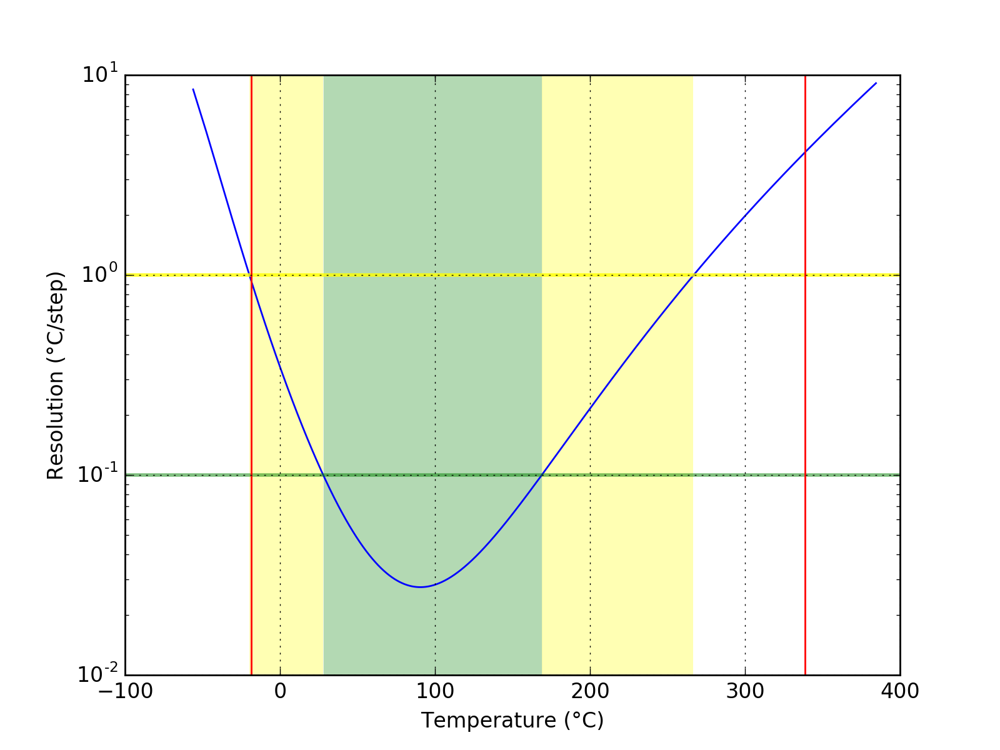
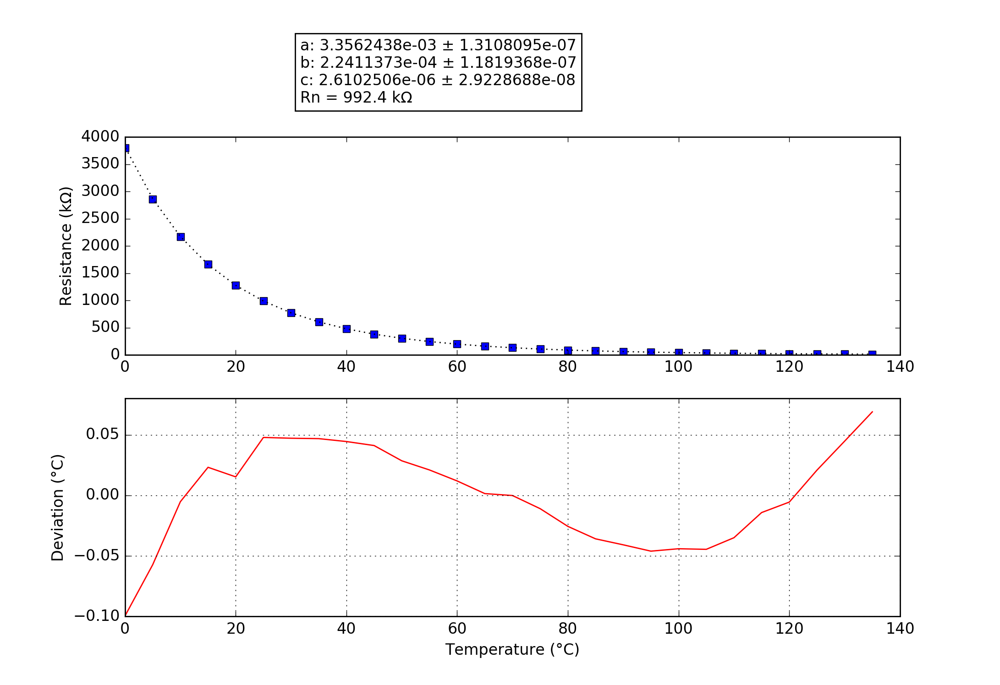

## Maverick ET-732,733,735
### Probe performance data

Values based on 47k measurement resistor.

Property | Symbol | Value
-------- | -------- | --------
Resistance at 0°C | R25 | 3819.00k
Resistance at 25°C | R25 | 990.02k
Resistance at 85°C | R25 | 74.45k
Beta 25°C to 85°C | B25/85| 4605K
Minimum measurable temperature | | -18.6°C
Minimum high-res temperature | | 27.9°C
Highest resolution || 2.75e-02°C/step at 90.6°C
Maximum high-res temperature | | 168.8°C
Maximum measurable temperature | | 338.8°C

### Probe curve data

Property | Symbol | Value
-------- | -------- | --------
Resistance near 25°C | R251 | 992.40k
Steinhart-Hart coefficient | a | 3.3562438e-03 ± 1.3108095e-07
Steinhart-Hart coefficient | b | 2.2411373e-04 ± 1.1819368e-07
Steinhart-Hart coefficient | c | 2.6102506e-06 ± 2.9228688e-08

1: The deviation between this R25 and the R25 shown above is not relevant, this R25 is taken from the original data point which is closest to 25°C. The value taken as a factor into the calculation of the final value and serves only a scaling purpose to the Steinhart-Hart coefficients.
