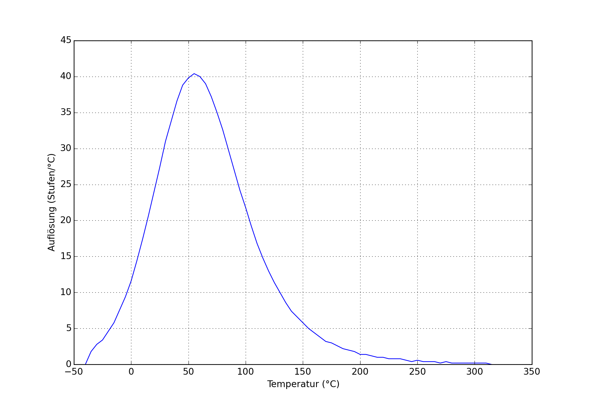
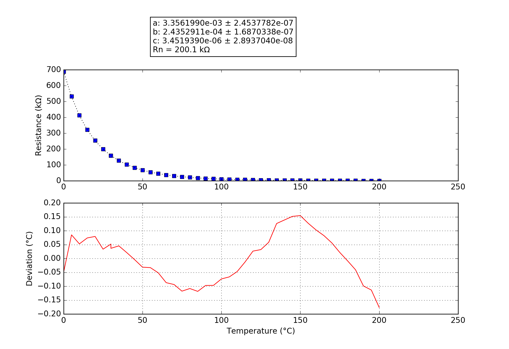

## PERFEKTION
### Probe performance data

Values based on 47k measurement resistor.

Property | Symbol | Value
-------- | -------- | --------
Resistance at 0°C | R25 | 690.16k
Resistance at 25°C | R25 | 199.69k
Resistance at 85°C | R25 | 18.29k
Beta 25°C to 85°C | B25/85| 4254K
Minimum measurable temperature | | 262.7°C
Minimum high-res temperature | | 127.0°C
Highest resolution || 2.48e-02°C/step at 52.8°C
Maximum high-res temperature | | -6.2°C
Maximum measurable temperature | | -43.1°C

### Probe curve data

Property | Symbol | Value
-------- | -------- | --------
Resistance near 25°C | R251 | 200.10k
Steinhart-Hart coefficient | a | 3.3561990e-03 ± 2.4537782e-07
Steinhart-Hart coefficient | b | 2.4352911e-04 ± 1.6870338e-07
Steinhart-Hart coefficient | c | 3.4519390e-06 ± 2.8937040e-08

1: The deviation between this R25 and the R25 shown above is not relevant, this R25 is taken from the original data point which is closest to 25°C. The value taken as a factor into the calculation of the final value and serves only a scaling purpose to the Steinhart-Hart coefficients.
