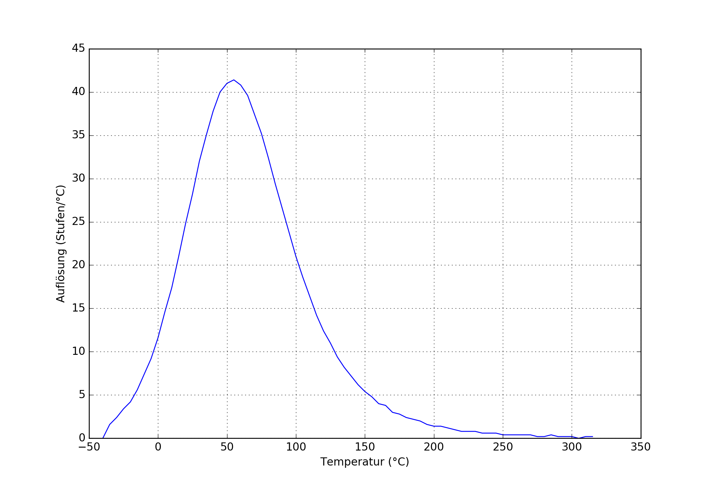
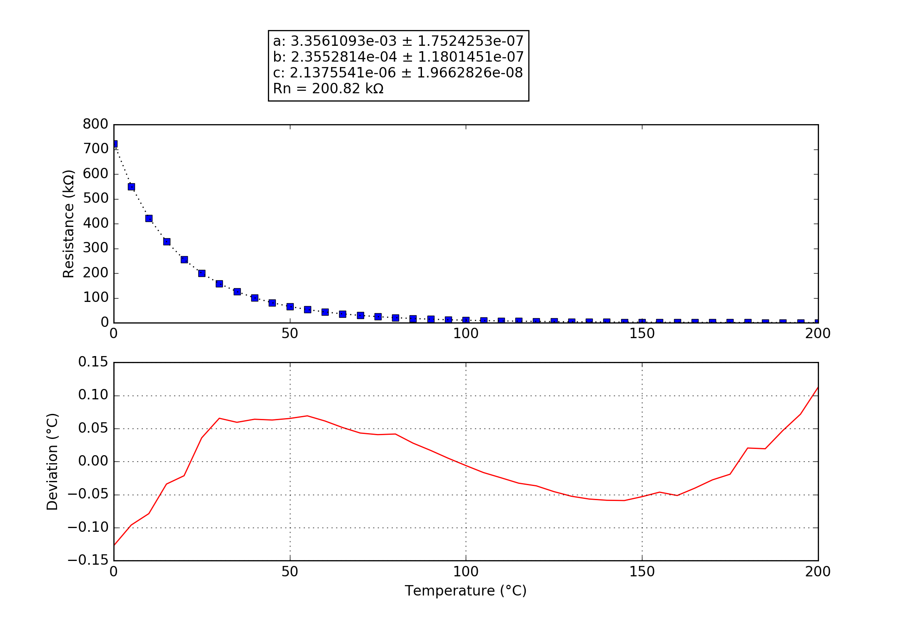

## Santos
### Probe performance data

Values based on 47k measurement resistor.

Property | Symbol | Value
-------- | -------- | --------
Resistance at 0°C | R25 | 728.04k
Resistance at 25°C | R25 | 200.48k
Resistance at 85°C | R25 | 17.44k
Beta 25°C to 85°C | B25/85| 4346K
Minimum measurable temperature | | 264.7°C
Minimum high-res temperature | | -5.9°C
Highest resolution || 2.42e-02°C/step at 51.7°C
Maximum high-res temperature | | 125.3°C
Maximum measurable temperature | | -40.4°C

### Probe curve data

Property | Symbol | Value
-------- | -------- | --------
Resistance near 25°C | R251 | 200.82k
Steinhart-Hart coefficient | a | 3.3561093e-03 ± 1.7524253e-07
Steinhart-Hart coefficient | b | 2.3552814e-04 ± 1.1801451e-07
Steinhart-Hart coefficient | c | 2.1375541e-06 ± 1.9662826e-08

1: The deviation between this R25 and the R25 shown above is not relevant, this R25 is taken from the original data point which is closest to 25°C. The value taken as a factor into the calculation of the final value and serves only a scaling purpose to the Steinhart-Hart coefficients.
