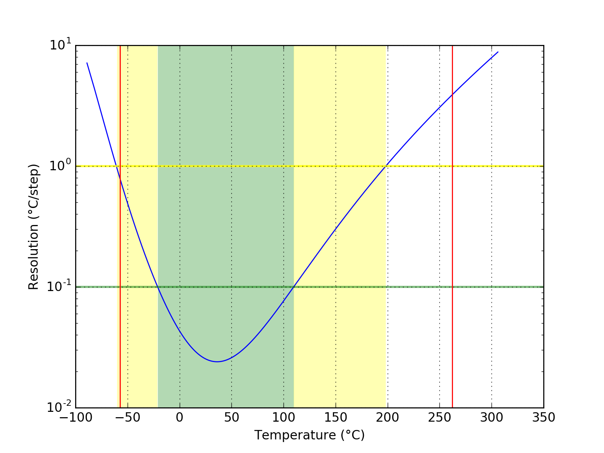
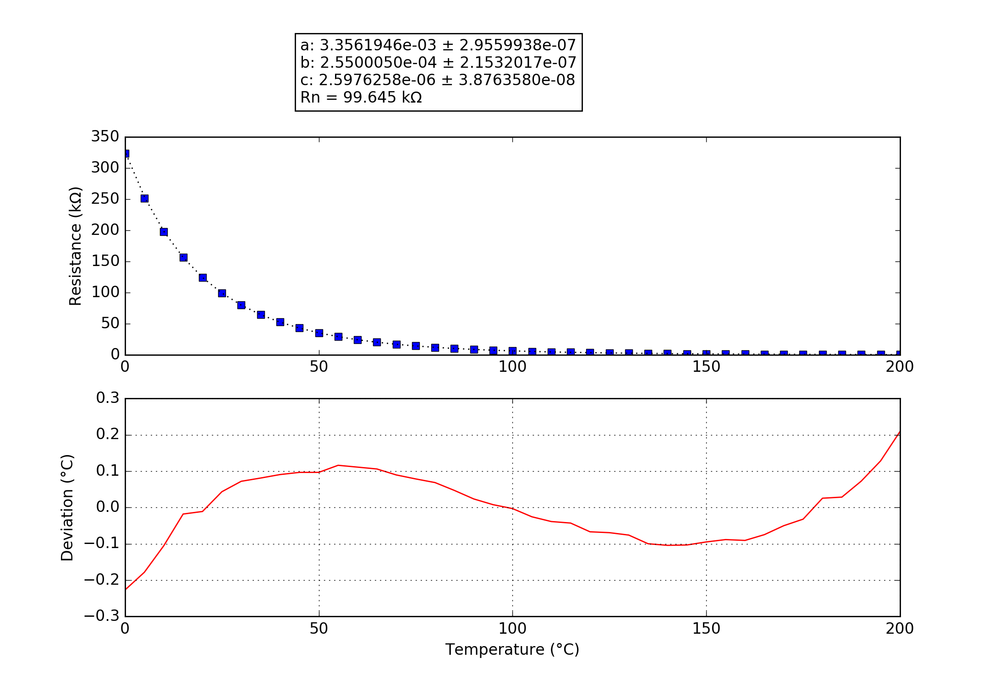

## SmokeMAX
### Probe performance data

Values based on 47k measurement resistor.

Property | Symbol | Value
-------- | -------- | --------
Resistance at 0°C | R25 | 327.14k
Resistance at 25°C | R25 | 99.45k
Resistance at 85°C | R25 | 10.40k
Beta 25°C to 85°C | B25/85| 4018K
Minimum measurable temperature | | -57.4°C
Minimum high-res temperature | | -21.0°C
Highest resolution || 2.40e-02°C/step at 36.1°C
Maximum high-res temperature | | 109.8°C
Maximum measurable temperature | | 262.3°C

### Probe curve data

Property | Symbol | Value
-------- | -------- | --------
Resistance near 25°C | R251 | 99.64k
Steinhart-Hart coefficient | a | 3.3561946e-03 ± 2.9559938e-07
Steinhart-Hart coefficient | b | 2.5500050e-04 ± 2.1532017e-07
Steinhart-Hart coefficient | c | 2.5976258e-06 ± 3.8763580e-08

1: The deviation between this R25 and the R25 shown above is not relevant, this R25 is taken from the original data point which is closest to 25°C. The value taken as a factor into the calculation of the final value and serves only a scaling purpose to the Steinhart-Hart coefficients.
