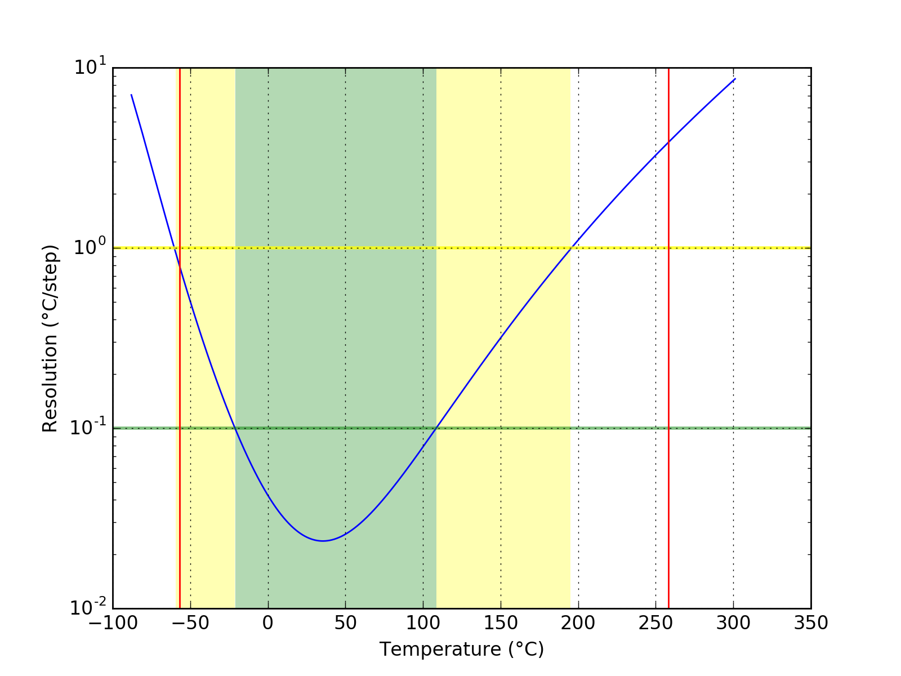
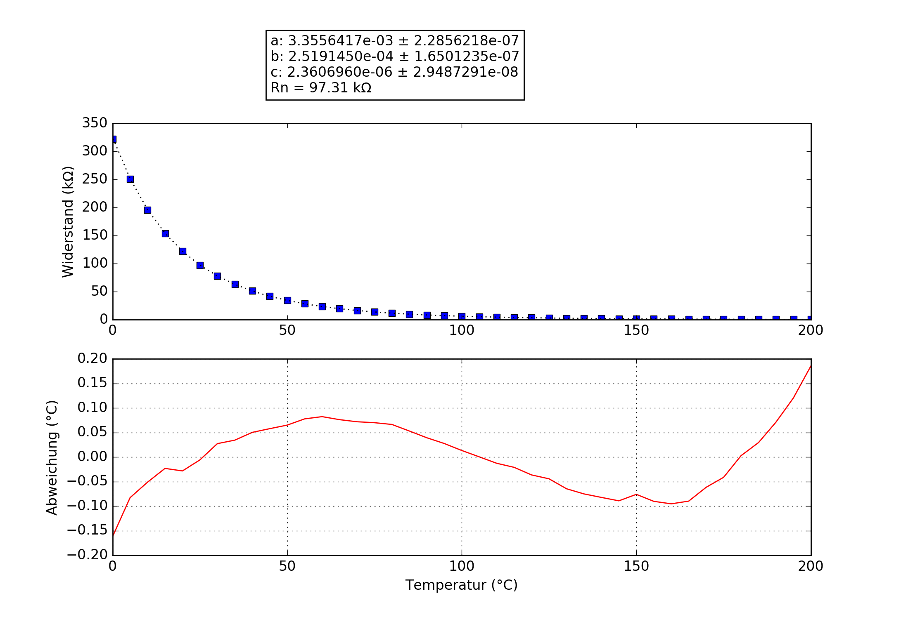

## ThermoWorks
### Probe performance data

Values based on 47k measurement resistor.

Property | Symbol | Value
-------- | -------- | --------
Resistance at 0°C | R25 | 325.18k
Resistance at 25°C | R25 | 97.33k
Resistance at 85°C | R25 | 9.94k
Beta 25°C to 85°C | B25/85| 4060K
Minimum measurable temperature | | 248.1°C
Minimum high-res temperature | | -21.1°C
Highest resolution || 2.36e-02°C/step at 35.5°C
Maximum high-res temperature | | 108.5°C
Maximum measurable temperature | | -53.8°C

### Probe curve data

Property | Symbol | Value
-------- | -------- | --------
Resistance near 25°C | R251 | 97.31k
Steinhart-Hart coefficient | a | 3.3556417e-03 ± 2.2856218e-07
Steinhart-Hart coefficient | b | 2.5191450e-04 ± 1.6501235e-07
Steinhart-Hart coefficient | c | 2.3606960e-06 ± 2.9487291e-08

1: The deviation between this R25 and the R25 shown above is not relevant, this R25 is taken from the original data point which is closest to 25°C. The value taken as a factor into the calculation of the final value and serves only a scaling purpose to the Steinhart-Hart coefficients.
