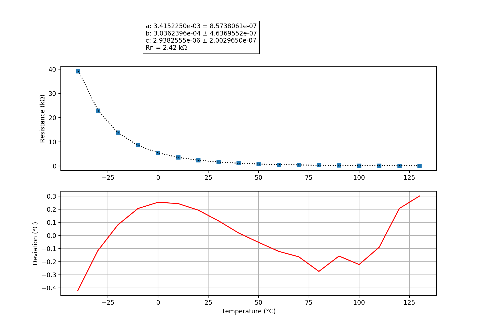

## Bosch_HFM5
### Probe performance data

Values based on 47k measurement resistor.

Property | Symbol | Value
-------- | -------- | --------
Resistance at 0°C | R0 | 5.44k
Resistance at 25°C | R25 | 1.99k
Resistance at 85°C | R85 | 0.30k
Beta 25°C to 85°C | B25/85| 3371K
Minimum measurable temperature | | -112.0°C
Minimum high-res temperature | | -91.6°C
Highest resolution || 1.64e-02°C/step at -47.0°C
Maximum high-res temperature | | 12.1°C
Maximum measurable temperature | | 101.5°C

### Probe curve data

Property | Symbol | Value
-------- | -------- | --------
Resistance near 25°C | R251 | 2.42k
Steinhart-Hart coefficient | a | 3.4152250e-03 ± 8.5738061e-07
Steinhart-Hart coefficient | b | 3.0362396e-04 ± 4.6369552e-07
Steinhart-Hart coefficient | c | 2.9382555e-06 ± 2.0029650e-07

1: The deviation between this R25 and the R25 shown above is not relevant, this R25 is taken from the original data point which is closest to 25°C. The value taken as a factor into the calculation of the final value and serves only a scaling purpose to the Steinhart-Hart coefficients.
