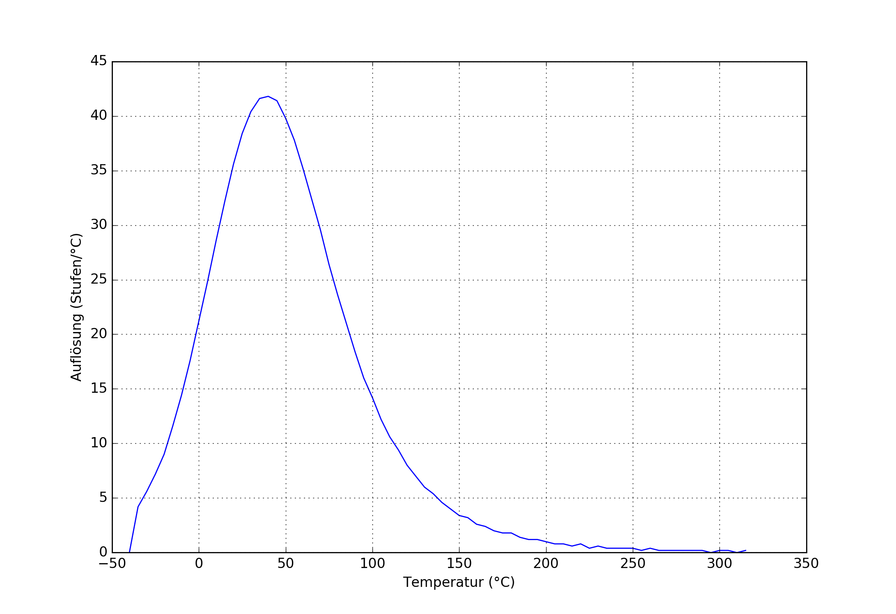
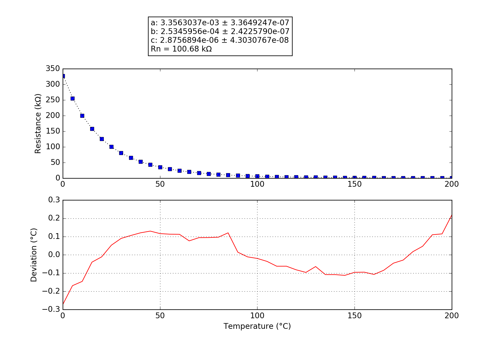

## Cappec
### Probe performance data

Values based on 47k measurement resistor.

Property | Symbol | Value
-------- | -------- | --------
Resistance at 0°C | R25 | 332.23k
Resistance at 25°C | R25 | 100.44k
Resistance at 85°C | R25 | 10.30k
Beta 25°C to 85°C | B25/85| 4054K
Minimum measurable temperature | | -57.2°C
Minimum high-res temperature | | -20.6°C
Highest resolution || 2.39e-02°C/step at 36.5°C
Maximum high-res temperature | | 109.7°C
Maximum measurable temperature | | 257.2°C

### Probe curve data

Property | Symbol | Value
-------- | -------- | --------
Resistance near 25°C | R251 | 100.68k
Steinhart-Hart coefficient | a | 3.3563037e-03 ± 3.3649247e-07
Steinhart-Hart coefficient | b | 2.5345956e-04 ± 2.4225790e-07
Steinhart-Hart coefficient | c | 2.8756894e-06 ± 4.3030767e-08

1: The deviation between this R25 and the R25 shown above is not relevant, this R25 is taken from the original data point which is closest to 25°C. The value taken as a factor into the calculation of the final value and serves only a scaling purpose to the Steinhart-Hart coefficients.
