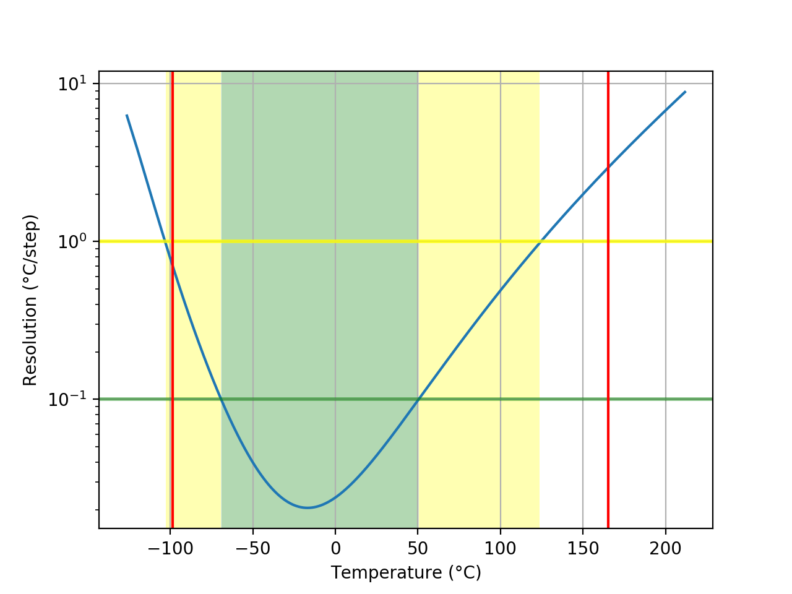
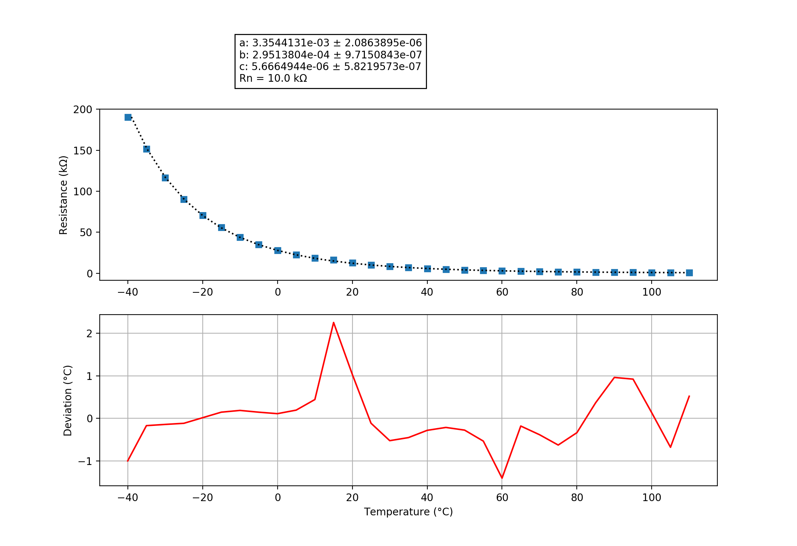

## MF52-103_B3435
### Probe performance data

Values based on 47k measurement resistor.

Property | Symbol | Value
-------- | -------- | --------
Resistance at 0°C | R0 | 27.88k
Resistance at 25°C | R25 | 10.04k
Resistance at 85°C | R85 | 1.39k
Beta 25°C to 85°C | B25/85| 3525K
Minimum measurable temperature | | -98.5°C
Minimum high-res temperature | | -69.1°C
Highest resolution || 2.05e-02°C/step at -16.9°C
Maximum high-res temperature | | 50.4°C
Maximum measurable temperature | | 165.3°C

### Probe curve data

Property | Symbol | Value
-------- | -------- | --------
Resistance near 25°C | R251 | 10.00k
Steinhart-Hart coefficient | a | 3.3544131e-03 ± 2.0863895e-06
Steinhart-Hart coefficient | b | 2.9513804e-04 ± 9.7150843e-07
Steinhart-Hart coefficient | c | 5.6664944e-06 ± 5.8219573e-07

1: The deviation between this R25 and the R25 shown above is not relevant, this R25 is taken from the original data point which is closest to 25°C. The value taken as a factor into the calculation of the final value and serves only a scaling purpose to the Steinhart-Hart coefficients.
