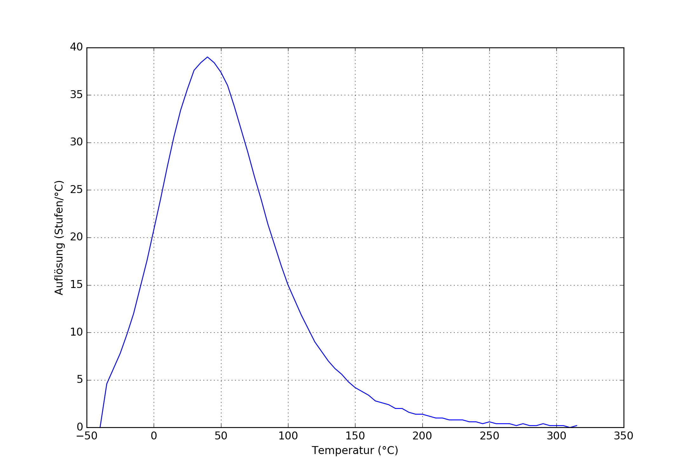
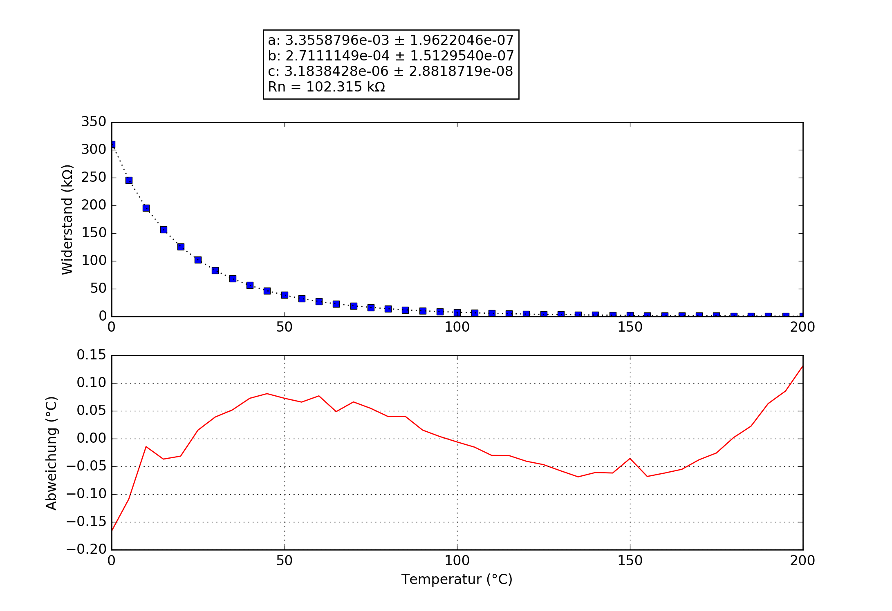

## Weber_6743
### Probe performance data

Values based on 47k measurement resistor.

Property | Symbol | Value
-------- | -------- | --------
Resistance at 0°C | R0 | 313.00k
Resistance at 25°C | R25 | 102.25k
Resistance at 85°C | R85 | 12.18k
Beta 25°C to 85°C | B25/85| 3787K
Minimum measurable temperature | | -61.1°C
Minimum high-res temperature | | -21.9°C
Highest resolution || 2.57e-02°C/step at 37.2°C
Maximum high-res temperature | | 113.7°C
Maximum measurable temperature | | 287.6°C

### Probe curve data

Property | Symbol | Value
-------- | -------- | --------
Resistance near 25°C | R251 | 102.31k
Steinhart-Hart coefficient | a | 3.3558796e-03 ± 1.9622046e-07
Steinhart-Hart coefficient | b | 2.7111149e-04 ± 1.5129540e-07
Steinhart-Hart coefficient | c | 3.1838428e-06 ± 2.8818719e-08

1: The deviation between this R25 and the R25 shown above is not relevant, this R25 is taken from the original data point which is closest to 25°C. The value taken as a factor into the calculation of the final value and serves only a scaling purpose to the Steinhart-Hart coefficients.
