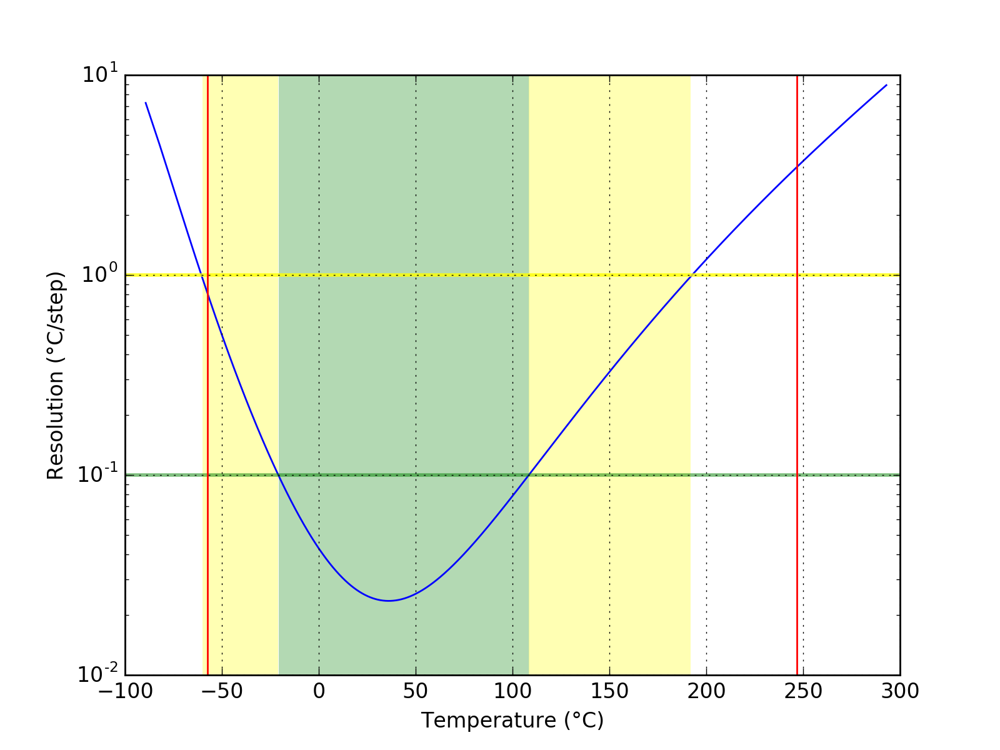
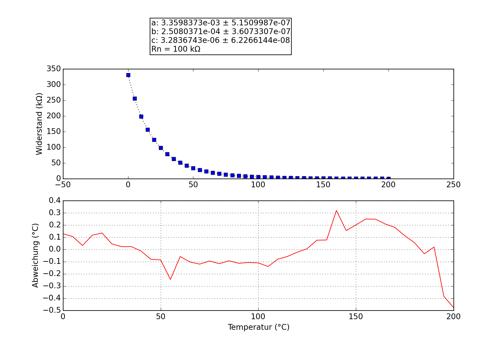

## iGrill
### Probe performance data

Values based on 47k measurement resistor.

Property | Symbol | Value
-------- | -------- | --------
Resistance at 0°C | R25 | 328.78k
Resistance at 25°C | R25 | 98.37k
Resistance at 85°C | R25 | 9.73k
Beta 25°C to 85°C | B25/85| 4117K
Minimum measurable temperature | | 237.7°C
Minimum high-res temperature | | 108.4°C
Highest resolution || 2.35e-02°C/step at 36.1°C
Maximum high-res temperature | | -20.8°C
Maximum measurable temperature | | -54.3°C

### Probe curve data

Property | Symbol | Value
-------- | -------- | --------
Resistance near 25°C | R251 | 98.57k
Steinhart-Hart coefficient | a | 3.3562256e-03 ± 5.1124254e-07
Steinhart-Hart coefficient | b | 2.5070912e-04 ± 3.5902582e-07
Steinhart-Hart coefficient | c | 3.2836745e-06 ± 6.2266111e-08

1: The deviation between this R25 and the R25 shown above is not relevant, this R25 is taken from the original data point which is closest to 25°C. The value taken as a factor into the calculation of the final value and serves only a scaling purpose to the Steinhart-Hart coefficients.
