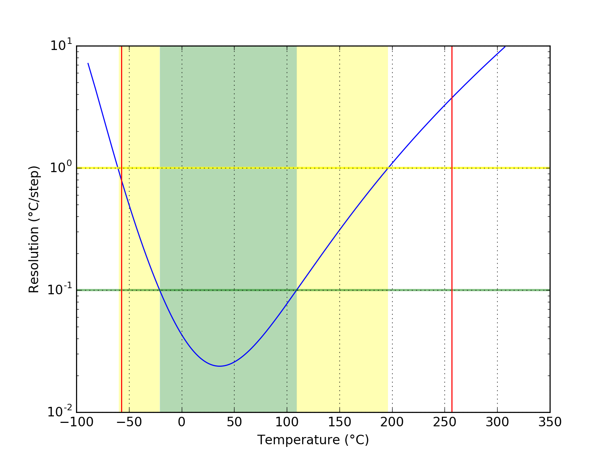
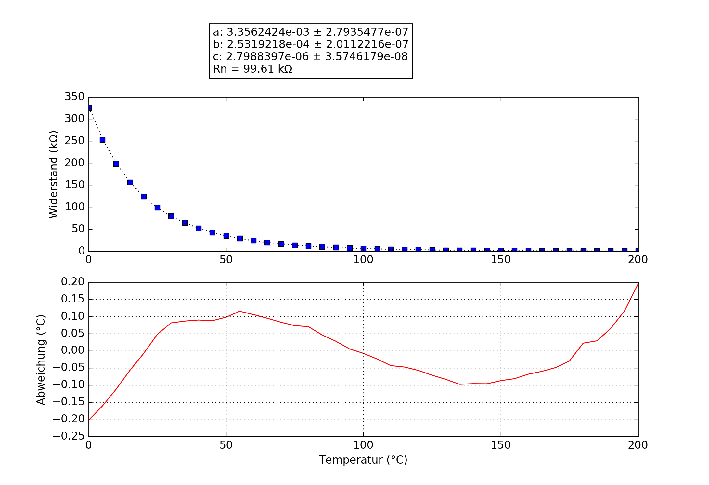

## iGrill2
### Probe performance data

Values based on 47k measurement resistor.

Property | Symbol | Value
-------- | -------- | --------
Resistance at 0°C | R0 | 329.32k
Resistance at 25°C | R25 | 99.40k
Resistance at 85°C | R85 | 10.18k
Beta 25°C to 85°C | B25/85| 4056K
Minimum measurable temperature | | -57.2°C
Minimum high-res temperature | | -20.8°C
Highest resolution || 2.38e-02°C/step at 36.2°C
Maximum high-res temperature | | 109.3°C
Maximum measurable temperature | | 256.9°C

### Probe curve data

Property | Symbol | Value
-------- | -------- | --------
Resistance near 25°C | R251 | 99.61k
Steinhart-Hart coefficient | a | 3.3562424e-03 ± 2.7935477e-07
Steinhart-Hart coefficient | b | 2.5319218e-04 ± 2.0112216e-07
Steinhart-Hart coefficient | c | 2.7988397e-06 ± 3.5746179e-08

1: The deviation between this R25 and the R25 shown above is not relevant, this R25 is taken from the original data point which is closest to 25°C. The value taken as a factor into the calculation of the final value and serves only a scaling purpose to the Steinhart-Hart coefficients.
